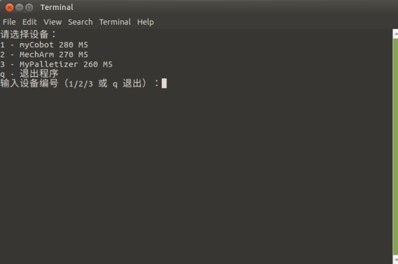
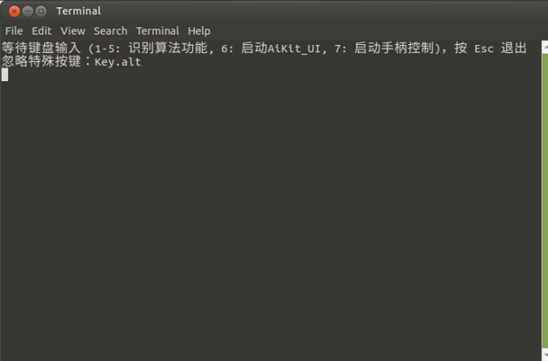
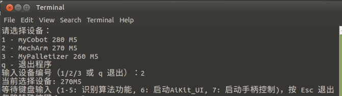

# AiKit Convenient Kit

Use Python + OpenCV to perform color recognition, shape recognition, feature point image recognition, AR QR code recognition, and YOLOv5 image recognition on the robotic arm. It also supports launching the AiKit_UI graphical software and controller control program.

## 1 Supported Robot Arm Models

- myCobot 280 M5
- myCobot 280 PI
- myPalletizer 260 M5
- myPalletizer 260 PI
- MechArm 270 M5
- MechArm 270 PI

## 2 Operating Environment

Linux Raspberry Pi system + package components + USB integrated keyboard and mouse controller. The end effector only supports the myCobot Vertical Suction Pump 2.0.

## 3 Code Installation

```bash
cd ~
git clone -b Convenient_AiKit https://github.com/elephantrobotics/aikit_V2.git
git clone -b Convenient_AiKit https://github.com/elephantrobotics/AiKit_UI.git
```

## 4 Dependency Library Installation

```bash
cd ~/aikit_V2
pip install -r requirements.txt
```

## 5 Setting up autostart

1. Grant executable permissions to the script:

```bash
cd ~/aikit_V2
sudo chmod +x start_aikit*.sh
```

2. Copy the autostart script `.desktop file` to the `~/.config/autostart` folder. Different scripts are used for different devices.

- 280M5, 270M5, and 260M5 devices:

```bash
cd ~/aikit_V2
cp aikit_autostart.desktop $HOME/.config/autostart/aikit_autostart.desktop
```

- 280PI devices:

```bash
cd ~/aikit_V2
cp aikit_autostart_280PI.desktop $HOME/.config/autostart/aikit_autostart_280PI.desktop
```

- 270PI devices:

```bash
cd ~/aikit_V2
cp aikit_autostart_270PI.desktop $HOME/.config/autostart/aikit_autostart_270PI.desktop
```

- 260PI devices:

```bash
cd ~/aikit_V2
cp aikit_autostart_260PI.desktop $HOME/.config/autostart/aikit_autostart_260PI.desktop
```

3. Verifying Auto-Start

After restarting the system, a terminal will pop up on the desktop, as shown below:

- 280M5, 270M5, and 260M5 devices:

    

- 280/270/260PI devices:

    

This indicates that the program has successfully started automatically.

## 6 Function Usage

Supports launching color recognition, shape recognition, feature point image recognition, AR QR code recognition, YOLOv5 image recognition, AiKit_UI programs, and controller control programs.


### Device Selection

Follow the terminal prompts and select the corresponding robot arm model. If you are using a PI version device, skip this step. Here, we use the 270M5 as an example:



### Key Function Description

>> Note: Before use, ensure that the robot arm device and related USB devices are properly connected.

Keyboard Input:

`1`: Enables color recognition.

`2`: Enables shape recognition.

`3`: Enables AR QR code recognition.

`4`: Enables feature point image recognition.

`5`: Enables YOLOv5 recognition.

`6`: Enables the AiKit_UI graphical software, allowing you to directly use various recognition algorithms.

`7`: Enables controller control. After startup, switch your keyboard and mouse to controller mode. For controller button usage, refer to [Function Button Usage](https://docs.elephantrobotics.com/docs/mycobot_280_pi_en/3-FunctionsAndApplications/6.developmentGuide/python/9_HandleControl.html).

### Notes

1. The coordinate grabbing offsets in the recognition algorithm functions for keyboard keys 1 to 5 depend on the offsets in AiKit_UI. Therefore, to adjust the coordinate offsets, press `6` to launch the AiKit_UI program, make the changes, and save the changes.

2. The program supports direct switching of recognition algorithm functions. For example, if you are currently running the **color recognition function**, you can directly press `2` to switch to the **shape recognition function**. If you are currently running the **AiKit_UI** program, you must manually close the program in the upper-right corner of the UI program before you can switch to other recognition algorithm functions.

3. If the camera doesn't automatically define the recognition area correctly, close the program and adjust the camera's position, such as by moving it left or right.

4. OpenCV color recognition is affected by the environment. Recognition performance will be significantly reduced in low light or bright conditions.

5. Different recognition algorithms are used for different materials. Please select the appropriate one.

